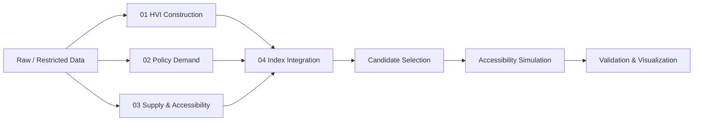

# Seoul Moa Center Site Prioritization

## 서울시 주거취약지역 기반 모아센터 입지 우선순위 분석

Data-driven site prioritization for additional Moa Centers in Seoul.

본 프로젝트는 서울시 행정동 단위의 주거 취약성, 정책 수요, 기존 모아센터 접근성을 함께 분석하여 모아센터 추가 설치 우선순위를 도출한 공간 데이터 기반 정책 분석 프로젝트입니다.

단순히 취약한 지역을 찾는 데서 끝나지 않고 다음 질문에 답하는 것을 목표로 했습니다.

> 어디에 모아센터를 우선적으로 추가 배치하는 것이 타당한가?

## Project Summary

- 행정동 단위 Housing Vulnerability Index(HVI) 구축
- 고령층, 장애인, 저소득층, 생활환경, 재난, 안전, 범죄 취약성 기반 정책 수요 지표 산출
- 기존 모아센터 접근성 및 공급 공백 분석
- 신규 후보지 풀 필터링
- S0-S4 시나리오 기반 접근성 개선 효과 시뮬레이션
- 랜덤 배치 대비 최종 제안안의 정책 효과 검증
- 공간 시각화 기반 최종 후보지 분석

주요 결과물은 아래에서 확인할 수 있습니다.

- 분석 요약 보고서: [docs/report/analysis_summary.pdf](docs/report/analysis_summary.pdf)
- 발표 자료: [docs/presentation/analysis_presentation.pptx](docs/presentation/analysis_presentation.pptx)

## Analysis Workflow



## Directory Structure

```bash
.
├── README.md
├── requirements.txt
├── data/
│   └── README.md
├── docs/
│   ├── presentation/
│   │   └── analysis_presentation.pptx
│   ├── report/
│   │   └── analysis_summary.pdf
│   └── references/
├── notebooks/
│   ├── 01_hvi_construction/
│   ├── 02_policy_demand/
│   ├── 03_supply_accessibility/
│   ├── 04_index_integration/
│   └── 05_validation_visualization/
├── src/
│   ├── 01_candidate_selection/
│   │   └── build_candidate_pool.py
│   ├── 02_accessibility_simulation/
│   │   └── simulation.py
│   └── 03_visualization/
│       └── final_visualization_0421.py
├── assets/
│   ├── figures/
│   └── maps/
└── archive/
    └── hvi_experiments/
```

## Analysis Components

### 1. HVI Construction

`notebooks/01_hvi_construction/`

행정동 단위 주거 취약성을 정량화합니다.

- 저가 주거 비율
- 노후 주택 비율
- 연립·다세대 집적도
- 건축물대장 기반 데이터 품질 보완
- HVI 등급 및 지도 시각화

### 2. Policy Demand

`notebooks/02_policy_demand/`

모아센터 정책 수요를 반영하기 위한 하위 지표를 구축합니다.

- 노인 취약성
- 재난 취약성
- 치안 취약성
- 생활 인프라 지표
- 통신/생활 데이터 기반 보조 지표

### 3. Supply & Accessibility

`notebooks/03_supply_accessibility/`

기존 모아센터 위치와 행정동 대표점 기반 접근성을 확인합니다.

- 기존 모아센터 위치 확인
- 행정동 경계와 모아센터 공간 매핑
- 공급 공백 지역 탐색

### 4. Index Integration

`notebooks/04_index_integration/`

HVI, 정책 수요, 공급 공백 지표를 통합하여 최종 우선순위 지표를 산출합니다.

### 5. Candidate Selection & Simulation

`src/01_candidate_selection/build_candidate_pool.py`

- 기존 모아센터 위치 행정동 제외
- HVI 0 또는 분석 제외 행정동 제외
- 정책 수요 하위 지역 제외
- 후보지 목록과 필터링 로그 저장

`src/02_accessibility_simulation/simulation.py`

- S0: 기존 14개 모아센터
- S1: 랜덤 14개 추가 배치, 1,000회 반복
- S2: 정책 수요 지표 상위 14개
- S3: 최종 지표 상위 14개
- S4: HVI 필터와 공간 확산 효과를 고려한 최종 제안

### 6. Visualization

`src/03_visualization/final_visualization_0421.py`

- HVI 지도
- 후보지 지도
- 시나리오별 접근성 개선 결과
- 발표/보고서용 시각화 산출물

기존 산출 이미지는 [assets/figures](assets/figures), HTML 지도는 [assets/maps](assets/maps)에 정리했습니다.

## Deliverables

| Type | Path | Description |
|---|---|---|
| Summary Report | `docs/report/analysis_summary.pdf` | 대회 제출용 요약 분석결과서 |
| Presentation | `docs/presentation/analysis_presentation.pptx` | 발표용 슬라이드 원본 |
| Interactive Map | `assets/maps/moa_center_map_complete.html` | 기존/후보 모아센터 지도 산출물 |
| Figure | `assets/figures/correlation_heatmap_core.png` | 핵심 지표 상관관계 시각화 |

## How To Run

원본 데이터는 일부 반출 정책상 공개가 제한되어 있습니다. 실행 전 [data/README.md](data/README.md)의 구조에 맞게 데이터를 배치해야 합니다.

```bash
pip install -r requirements.txt
python src/01_candidate_selection/build_candidate_pool.py
python src/02_accessibility_simulation/simulation.py
python src/03_visualization/final_visualization_0421.py
```

## Main Outputs

스크립트 실행 후 주요 결과는 `data/output/` 아래에 생성됩니다.

- `candidate_pool.csv`: 최종 후보군
- `filter_log.txt`: 후보군 필터링 과정 로그
- `simulation_result.csv`: 시나리오별 접근성 개선 결과
- `coverage_score_result.csv`: 새로 커버된 공백지역의 취약도 비교
- `simulation_summary.txt`: 시뮬레이션 로그 요약
- `figures/`: 랜덤 배치 비교 히스토그램, 거리 CDF 등

## Tech Stack

- Python
- Pandas, NumPy
- GeoPandas, Shapely
- SciPy
- Matplotlib, Seaborn
- Folium
- Jupyter Notebook

## Data Sources

- 서울시 빅데이터 캠퍼스
- 공공데이터포털
- 서울시 건축물대장 데이터
- 서울시 행정동 경계 데이터
- 기존 모아센터 위치 정보

일부 원본 데이터는 반출 정책상 공개가 제한될 수 있어 저장소에는 포함하지 않았습니다.

## Limitations

- 행정동 대표점 기반 거리 계산을 사용하여 실제 보행 접근성과 차이가 있을 수 있습니다.
- 원본 데이터 접근 제한으로 공개 저장소에서는 일부 재현 과정이 제한될 수 있습니다.
- 실제 설치 가능성은 부지, 예산, 행정 절차 등 추가 검토가 필요합니다.

## Conclusion

본 프로젝트는 주거 취약성, 정책 수요, 공급 공백을 함께 고려하여 서울시 모아센터 추가 설치 우선순위를 도출하고, 시뮬레이션을 통해 접근성 개선 효과를 검증했습니다. 단일 지표 기반 접근이 아니라 공간적 공급 불균형과 정책 수요를 함께 반영했다는 점에서 공공정책 기반 공간 데이터 분석 사례로 의미가 있습니다.
