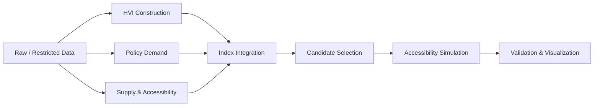

# 🏘️ 서울시 주거취약지역 기반 모아센터 입지 우선순위 분석

### Data-Driven Site Prioritization for Additional Moa Centers in Seoul

> 주거 취약성, 정책 수요, 공급 공백을 기반으로 서울시 모아센터 추가 입지 우선순위를 분석한 공간 데이터 기반 정책 분석 프로젝트

---

## Overview

본 프로젝트는 서울시 행정동 단위의 주거 취약성(HVI), 정책 수요, 기존 모아센터 접근성을 종합적으로 분석하여 모아센터 추가 설치 우선순위를 도출한 프로젝트입니다.

단순히 취약한 지역을 찾는 데서 끝나지 않고,

- 주거 취약성
- 정책 수요
- 기존 공급 공백
- 접근성 개선 효과

를 함께 고려하여,

> "어디에 모아센터를 우선적으로 추가 배치하는 것이 타당한가?"

를 데이터 기반으로 분석하는 것을 목표로 했습니다.

---

## Key Features

- 행정동 단위 Housing Vulnerability Index(HVI) 구축
- 고령층, 재난, 치안, 생활 인프라 등 정책 수요 지표 산출
- 기존 모아센터 위치 및 접근성 분석
- 공급 공백(Supply Gap) 기반 후보지 선정
- 거리 기반 접근성 개선 효과 시뮬레이션
- Random Allocation 대비 정책 제안안 효과 검증
- 공간 시각화 기반 최종 후보지 분석

---

## Deliverables

| Type | File | Description |
|---|---|---|
| Summary Report | [analysis_summary.pdf](docs/report/analysis_summary.pdf) | 대회 제출용 요약 분석결과서 |
| Presentation | [analysis_presentation.pptx](docs/presentation/analysis_presentation.pptx) | 발표용 슬라이드 원본 |
| Interactive Map | [moa_center_map_complete.html](assets/maps/moa_center_map_complete.html) | 모아센터 위치 및 공간 분석 지도 |
| Figure | [correlation_heatmap_core.png](assets/figures/correlation_heatmap_core.png) | 핵심 지표 상관관계 시각화 |

---

## Tech Stack

#### Language

<p>
  
</p>

#### Data Processing & Analysis

<p>
  
  
  
  
</p>

#### Spatial Analysis & Simulation

<p>
  
  
  
  
</p>

#### Visualization

<p>
  
  
  
</p>

---

## Analysis Framework

### 1️⃣ Housing Vulnerability Index (HVI)

행정동 단위의 주거 취약성을 정량화하기 위해 다음 요소를 활용했습니다.

- 저가 주거 비율
- 노후 주택 비율
- 연립·다세대 집적도
- 건축물대장 기반 데이터 품질 보완

이를 통해 저가 주거, 노후도, 밀집도가 동시에 높은 지역을 주거취약지역으로 정의했습니다.

### 2️⃣ Policy Demand Index

모아센터의 정책적 필요성을 반영하기 위해 다음 지표를 활용했습니다.

- 고령층 관련 지표
- 장애인 및 저소득층 관련 지표
- 생활 인프라 지표
- 재난·안전 지표
- 범죄 취약성 지표
- 통신/생활 데이터 기반 보조 지표

### 3️⃣ Accessibility & Supply Gap

기존 모아센터 공급 현황과 접근성을 함께 고려했습니다.

- 기존 모아센터 위치 행정동 제외
- 행정동 대표점 기준 거리 계산
- 접근성이 낮은 행정동 식별
- 공급 공백 지역 분석
- 추가 설치 시 접근성 개선 효과 시뮬레이션

---

## Analysis Workflow



---

## Simulation Scenarios

| Scenario | Description |
|---|---|
| S0 | Existing 14 Centers (Baseline) |
| S1 | Random 14 Allocation (1,000 Iterations) |
| S2 | Top 14 by Demand Index |
| S3 | Top 14 by Final Index |
| S4 | Final Proposal with HVI Filter & Spillover Effect |

---

## Main Findings

- 기존 공급 대비 접근성 취약 지역 식별
- 공급 공백 기반 후보지 도출
- Random Allocation 대비 공간적 개선 효과 확인
- 정책 수요와 주거 취약성을 동시에 반영한 입지 선정 가능성 검증
- 추가 배치 시 접근성 개선 효과 확인

---

## Directory Structure

```bash
.
├── README.md
├── requirements.txt
├── data/
│   └── README.md
├── docs/
│   ├── presentation/
│   │   └── analysis_presentation.pptx
│   ├── report/
│   │   └── analysis_summary.pdf
│   └── references/
├── notebooks/
│   ├── 01_hvi_construction/
│   ├── 02_policy_demand/
│   ├── 03_supply_accessibility/
│   ├── 04_index_integration/
│   └── 05_validation_visualization/
├── src/
│   ├── 01_candidate_selection/
│   ├── 02_accessibility_simulation/
│   └── 03_visualization/
├── assets/
│   ├── figures/
│   └── maps/
└── archive/
    └── hvi_experiments/
```

---

## Repository Guide

### `notebooks/01_hvi_construction`

- B068 및 건축물대장 기반 HVI 산출
- 저가 주거, 노후 주택, 집적도 지표 구성
- HVI 등급 및 지도 시각화

### `notebooks/02_policy_demand`

- 노인, 재난, 치안, 인프라, 통신/생활 데이터 기반 정책 수요 지표 산출

### `notebooks/03_supply_accessibility`

- 기존 모아센터 위치 확인
- 행정동 경계와 모아센터 공간 매핑
- 공급 공백 지역 탐색

### `notebooks/04_index_integration`

- HVI, 정책 수요, 공급 공백 지표 통합
- 최종 우선순위 지표 산출

### `notebooks/05_validation_visualization`

- 최종 지표 검토
- 결과 해석 및 시각화 검증

---

## Main Scripts

### `src/01_candidate_selection/build_candidate_pool.py`

- 기존 모아센터 행정동 제외
- HVI = 0 또는 분석 제외 행정동 제외
- 정책 수요 하위 지역 제외
- 후보지 목록 생성
- 필터링 로그 저장

### `src/02_accessibility_simulation/simulation.py`

- 기존 접근성 계산(S0)
- S1-S4 시나리오 비교
- 랜덤 배치 대비 효과 분석
- 접근성 개선 효과 계산

### `src/03_visualization/final_visualization_0421.py`

- 행정동별 지표 시각화
- 최종 후보지 지도화
- 접근성 개선 결과 시각화
- 발표용 결과 이미지 생성

---

## How To Run

원본 데이터는 일부 반출 정책상 공개가 제한되어 있습니다. 실행 전 [data/README.md](data/README.md)의 구조에 맞게 데이터를 배치해야 합니다.

```bash
pip install -r requirements.txt

python src/01_candidate_selection/build_candidate_pool.py
python src/02_accessibility_simulation/simulation.py
python src/03_visualization/final_visualization_0421.py
```

스크립트 실행 후 주요 결과는 `data/output/` 아래에 생성됩니다.

- `candidate_pool.csv`
- `filter_log.txt`
- `simulation_result.csv`
- `coverage_score_result.csv`
- `simulation_summary.txt`
- `figures/`

---

## Data Sources

- 서울시 빅데이터 캠퍼스
- 공공데이터포털
- 서울시 건축물대장 데이터
- 서울시 행정동 경계 데이터
- 기존 모아센터 위치 정보

⚠️ 일부 원본 데이터는 반출 정책상 공개가 제한될 수 있어 저장소에는 포함하지 않았습니다.

---

## Limitations

- 행정동 대표점 기반 거리 계산 사용
- 실제 보행 접근성과 차이 가능성 존재
- 일부 데이터는 가공 지표 형태 활용
- 원본 데이터 접근 제한으로 공개 저장소에서는 일부 재현 과정 제한
- 실제 설치 가능성은 부지, 예산, 행정 절차 등 추가 검토 필요

---

## Conclusion

본 프로젝트는 주거 취약성, 정책 수요, 공급 공백을 함께 고려하여 서울시 내 모아센터 추가 설치 우선순위를 도출하고, 시뮬레이션을 통해 실제 접근성 개선 효과를 검증하는 데 초점을 두었습니다.

단일 지표 기반 접근이 아닌 공간적 공급 불균형과 정책 수요를 함께 반영했다는 점에서 공공정책 기반 공간 데이터 분석 사례로 의미가 있습니다.
